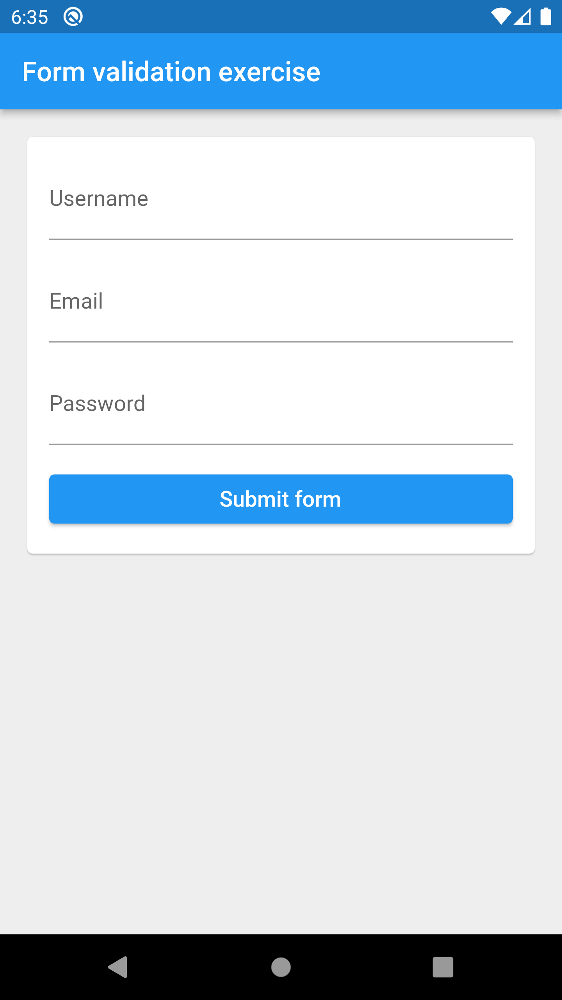
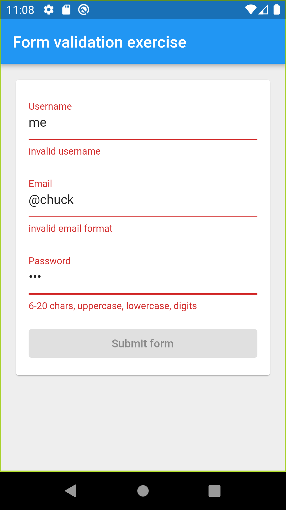

# Exercise E6 - input form with validation

Repository for exercise E6.
Course [IDATA2503 Mobile applications](https://www.ntnu.edu/studies/courses/IDATA2503)
at [NTNU](https://ntnu.edu), campus [Aalesund](https://www.ntnu.edu/alesund).

## Intention

The intention is to practice creating forms with user input and do some basic form validation and
display of error messages.

## Hand-in process

Create a clone of the template repository within GitHub Classroom. Use the invitation link you got
from Blackboard! Get the automated tests passing.

**To pass the assignment approved you need to get at least 180 points.**

## Testing

As always, you can run `flutter test` inside the project folder to run all the tests. As an
alternative, use the testing features in your IDE - right-click on the necessary places, etc. You
know the drill ;)

P.S. Remember how you can run tests in a single test-file? `flutter test test/step_1_1_test.dart`
etc.

## Instructions

Your task is to implement a form where the user can input username, email and password, and press on
a "Submit" button. If an input contains an incorrect value, you must mark that input field and
display an appropriate error message.

The implementation consists of two parts:

1. Creating the UI layout
2. Setting up validation logic

### Creating the layout

Create the elements for the input form according to the following specification (which will be
checked in the tests):

1. Add an input field for the username: a `TextField` widget (note: later we will talk
   about `TextFormField` widget as well, but don't use it for now as this may conflict with unit
   tests). Implement the following properties for this TextField:
    1. Set the `key` property for it to `username_input`. We have not used the `key` property
       before. In general - it is like an `id` used for web elements - an identifier that uniquely
       identifies an element in the UI (an instance of a widget). Hint: in the constructor you can
       set the key as follows: `key: Key("username_input")`
    2. Set the label to `Username`.
2. Add an input field for the email: a `TextField` widget with the following properties:
    1. The `key` property having value `email_input`.
    2. Label `Email`
    4. Make it an email-input field. I.e., when the user will enter the value here, she should see
       the keyboard layout made for entering email addresses.
3. Add an input field for the password with the following properties:
    1. `key` having value `password_input`
    2. Label `Password`
    3. Make it a password-input-field: the typed characters must not be visible!
4. Add a "Submit" button with the following features:
    1. `key` with value `submit_button`
    2. Text in it saying `Submit form`

When you are done with the UI, it should look something along these lines:

Note: there will be no comparison with a golden image in this exercise, therefore specific fonts,
paddings and color's don't matter in this case.

### Validation logic

Now implement the following logic for validation:

1. There should be no validation before the "Submit form" button is pressed. I.e., the user can
   enter any values and no error messages are shown first. Only after the "Submit form" button is
   pressed, the validation is enabled.
2. When the input field validation is enabled, the following rules apply:
    1. The username field is considered invalid if it does not satisfy the following mandatory
       requirements:
        1. It must contain only lowercase or uppercase letters from the English alphabet [a-z, A-Z],
           no other symbols are allowed (Norwegian letters øåæ are also not allowed).
        2. It must contain at least 3 characters
        3. It must not be longer than 12 characters
        4. Examples of valid usernames: `chuck`, `Chuck`, `cucumber`, `PewDiePie`, `cat`
        5. Examples of invalid usernames: `chuck12`, `nun-chuck`, `Pære`, `me`, empty string.
    2. Conditions for the email field to be considered valid:
        1. It must not be empty
        2. It must be a "valid email address". There are several rules (and different regular
           expressions available online). Find a solution for checking whether a string is a valid
           email address!
        3. Examples of valid email addresses: `microsoft@chuck.com`, `the.big_chuck@big.mac.com`
           , `chuck+ducktape@apple.com`
        4. Examples of invalid email addresses: `@thechuck`, `@thechuck.com`, `duck@`
    3. Password is considered valid if it contains the following:
        1. at least 6 characters
        2. no more than 20 characters (in total)
        3. at least one uppercase letter
        4. at least one lowercase letter
        5. at least one digit
    4. If any of the error mentioned above are detected (any of the fields contains an invalid
       value), the "Submit form" button is disabled
    5. The "Submit form" button is enabled again when all errors in the form are fixed and all input
       fields contain a valid value
    6. If the username is invalid, the `TextField` is marked with red and message "invalid username"
       is displayed below the field. (Hint: use `errorText` for the `TextField`, don't create a new
       widget for the error). See an example below.
    7. In a similar manner - if the email is invalid, show an error "invalid email format"
    8. If the password is invalid, show error "6-20 chars, uppercase, lowercase, digits".
3. If the "Submit form" button is pressed and all the fields are valid:
    1. Hide the "Submit form" button
    2. Disable all input fields - the user should not be able to change any text within them
    3. Display a `CircularProgressIndicator` in the place where the button was located

Here is an example of a form showing error messages for the fields:

P.S. This may sound like a lot of logic, but all the code you write should be re-usable in your
project ;)

P.P.S. For now you don't need to worry about separating the logic from the UI widgets , we will do
that a bit later.